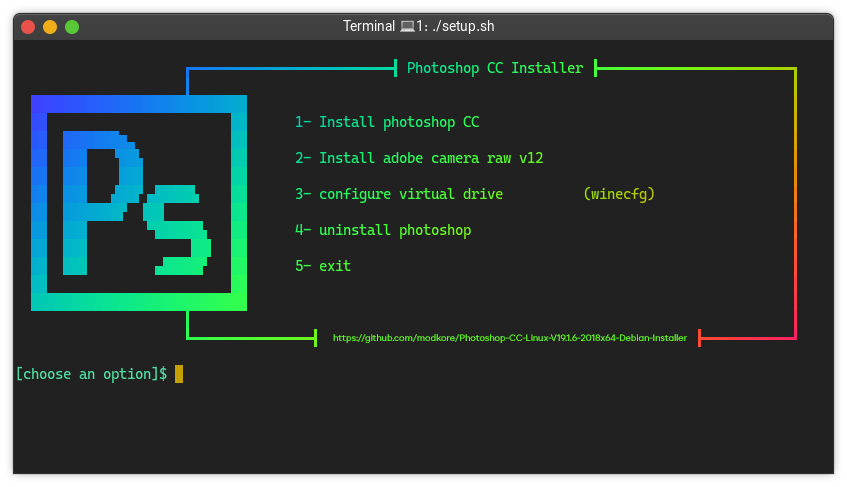
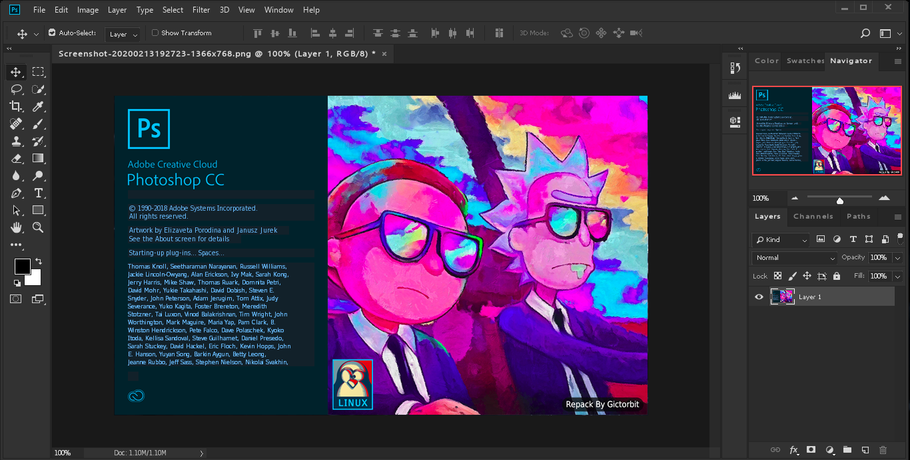

# Photoshop CC 2018 (v19.1.6) on Linux — Debian Installer Guide

> **Repository**: [modkore/Photoshop-CC-Linux-V19.1.6-2018x64-Debian-Installer](https://github.com/modkore/Photoshop-CC-Linux-V19.1.6-2018x64-Debian-Installer)
>
> **Purpose**: This repository provides shell scripts to prepare a Wine prefix, install required Winetricks components, and set up **Adobe Photoshop CC 2018 v19.1.6** on Linux.
>
> **Bring‑Your‑Own‑Installer**: You must already have a **legally obtained** Photoshop CC 2018 installer package. The scripts look for the archive in `~/.cache/winetricks/` (see below).
>
> **Disclaimer**: This project is community‑maintained and **not affiliated with Adobe**. You are responsible for complying with Adobe licensing and your local laws.

---

## Table of Contents

* [What this does](#what-this-does)
* [Requirements](#requirements)
* [Install Wine & Winetricks](#install-wine--winetricks)
* [Folder layout](#folder-layout)
* [Quick start](#quick-start)
* [Step‑by‑step install](#step-by-step-install)
* [Menu options in `setup.sh`](#menu-options-in-setupsh)
* [Launching Photoshop](#launching-photoshop)
* [Uninstall](#uninstall)
* [Advanced: environment variables & paths](#advanced-environment-variables--paths)
* [Troubleshooting](#troubleshooting)
* [FAQ](#faq)
* [Contributing](#contributing)
* [License](#license)

---

## What this does

These scripts automate the common steps required to run **Photoshop CC 2018 (19.1.6)** via **Wine** on Linux:

* Creates/uses a dedicated **Wine prefix** for Photoshop (no root needed)
* Installs required **Winetricks** components (fonts, runtimes, etc.)
* Uses your local **offline installer cache** at `~/.cache/winetricks/`
* Installs optional **Adobe Camera Raw**
* Generates a **desktop launcher** (`.desktop`) and a `launcher.sh`
* Opens **winecfg** for fine‑tuning when you want
* Provides a clean **uninstaller**

---

## Requirements

* **Debian/Ubuntu‑based distro (x86\_64)**
* **bash**, **git**, **wget**, **p7zip**
* **Wine** (Staging or regular) and **Winetricks**
* **Photoshop CC 2018 v19.1.6 installer files** you legally own

> Make sure you have at least **5 GiB free space** under `/home`. Around 1 GiB will be freed after installation.

---

## Install Wine & Winetricks

On **Debian/Ubuntu**:

```bash
sudo dpkg --add-architecture i386
sudo apt update
sudo apt install -y wine64 wine32 winetricks p7zip-full wget git
```

Check versions:

```bash
wine --version
winetricks --version
```

---

## Folder layout

```
.
├── setup.sh                          # Main interactive menu
├── launcher.sh                       # Starts Photoshop from the configured Wine prefix
├── photoshop.desktop                 # Desktop entry (installed/updated by setup)
├── scripts/
│   ├── PhotoshopSetup.sh             # Core install routine for Photoshop
│   ├── cameraRawInstaller.sh         # Optional Adobe Camera Raw installer
│   ├── winecfg.sh                    # Opens winecfg for this prefix
│   ├── uninstaller.sh                # Removes the prefix and desktop entries
│   └── sharedFuncs.sh                # Shared helpers (logging, checks, etc.)
├── images/                           # Screenshots/icons
│   ├── setup-screenshot.png
│   ├── Screenshot.png
│   └── AdobePhotoshop-icon.png
└── LICENSE                           # License
```

---

## Quick start

```bash
# 1) Clone repo
git clone https://github.com/modkore/Photoshop-CC-Linux-V19.1.6-2018x64-Debian-Installer.git
cd Photoshop-CC-Linux-V19.1.6-2018x64-Debian-Installer

# 2) Make scripts executable
chmod +x setup.sh scripts/*.sh launcher.sh

# 3) Place your Photoshop archive in the Winetricks cache
# Expected: ~/.cache/winetricks/PhotoshopCClinux-V19.1.6-2018x64.tgz

# 4) Run installer menu
./setup.sh
```

Pick **\[1] Install Photoshop CC** and follow prompts.

---

## Step‑by‑step install

1. **Prepare system**

   ```bash
   sudo dpkg --add-architecture i386
   sudo apt update
   sudo apt install -y wine64 wine32 winetricks p7zip-full wget git
   ```

2. **Clone scripts**

   ```bash
   git clone https://github.com/modkore/Photoshop-CC-Linux-V19.1.6-2018x64-Debian-Installer.git
   cd Photoshop-CC-Linux-V19.1.6-2018x64-Debian-Installer
   chmod +x setup.sh scripts/*.sh launcher.sh
   ```

3. **Place installer archive**

   * Copy `PhotoshopCClinux-V19.1.6-2018x64.tgz` into `~/.cache/winetricks/`

4. **Run menu**

   ```bash
   ./setup.sh
   ```

   * Creates Wine prefix
   * Installs Winetricks components
   * Extracts Photoshop archive
   * Sets up launcher

5. **Optional: Install Camera Raw**

   ```bash
   ./setup.sh
   # Select option 2
   ```

6. **Optional: Configure Wine**

   ```bash
   ./setup.sh
   # Select option 3
   ```

7. **Launch Photoshop**

   ```bash
   ./launcher.sh
   ```

---

## Menu options in `setup.sh`

1. Install Photoshop CC
2. Install Adobe Camera Raw
3. Open winecfg
4. Uninstall Photoshop CC
5. Exit

---

## Launching Photoshop

```bash
./launcher.sh
```

Or from Applications menu → *Adobe Photoshop CC 2018*.

---

## Uninstall

```bash
./setup.sh   # choose option 4
# or
./scripts/uninstaller.sh
```

---

## Advanced: environment variables & paths

See original README for details on `WINEPREFIX`, `PS_TGZ`, and overrides.

---

## Troubleshooting

* **Black canvas** → Disable GPU under Preferences → Performance
* **DLL errors** → Re-run prerequisites
* **File picker freeze** → Switch Wine version in `winecfg`

---

## FAQ

**Q: Does this download Photoshop?**
A: No, you must provide your own installer.

**Q: Can I use a custom Wine prefix?**
A: Yes, export `WINEPREFIX` before running `setup.sh`.

---

## Contributing

PRs welcome. Please don’t share Adobe binaries.

---

## License

See [LICENSE](LICENSE).

---

## Screenshots



